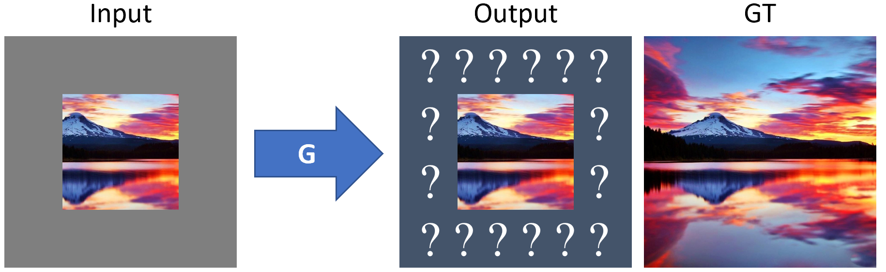
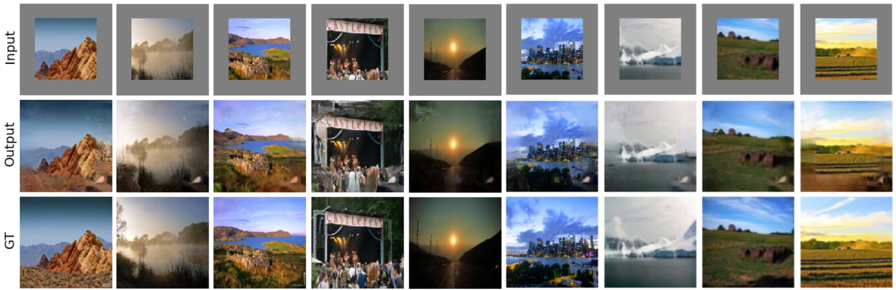
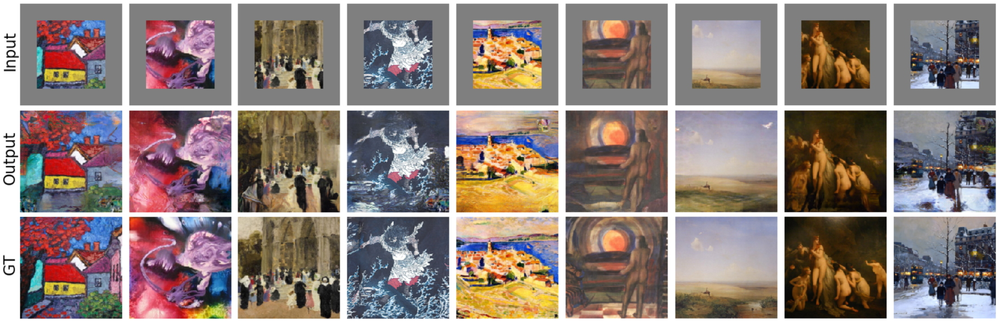

# Image Outpainting and Harmonization using GANs - PyTorch Implementation

This is some example code for my paper on [Image Outpainting and Harmonization using Generative Adversarial Networks
](https://arxiv.org/abs/1912.10960), which was made for the class Deep Learning for Computer Vision by Prof. Peter Belhumeur at Columbia University. Essentially, we extrapolate 128x128 RGB images into an 192x192 output by attempting to draw a reasonable hallucination of what could reside beyond every border of the input photo. The architecture is inspired by [Context Encoders: Feature Learning by Inpainting
](https://arxiv.org/abs/1604.07379). Part of my work explores [SinGAN](https://arxiv.org/abs/1905.01164) for style harmonization, but this post-processing step was done mostly manually so it is not included in this repository for now.

## Illustrations

Both figures shown here are evaluated either on the test or validation sets.

Natural photography:

Artwork:

## Usage

1. Prepare a dataset split into the following folders: *train*, *val*, and *test*. I used MIT Places365-Standard which can be downloaded here: [train](http://data.csail.mit.edu/places/places365/train_256_places365standard.tar), [val](http://data.csail.mit.edu/places/places365/val_256.tar), [test](http://data.csail.mit.edu/places/places365/test_256.tar). Another section of my work uses an artwork dataset scraped from WikiArt; I might post a link here later.

2. Edit and run train.py.

3. Run forward.py input.jpg output.jpg for evaluation of custom images. This script accepts arbitrary resolutions.

## Known issues

* The adversarial loss weight follows a specific schedule in order to prevent the generator from collapsing to a simple autoencoder, or reconstruction loss minimizer. However, making this term too important results in rather glitched but nonetheless sharper visuals. Room for improvement therefore exists in terms of finding a better balance.

Enjoy!